# 🚕 NYC Rideshare + Weather Pipeline

> End-to-end production-grade ETL pipeline — processing **19.8M raw NYC trips**  
> into business-ready Snowflake insights, enriched with live weather data.


## 📋 Project Overview

A **production-style cloud data pipeline** that processes real NYC Uber & Lyft 
trip data from the official TLC dataset.

| | |
|---|---|
| 📦 **Raw Data** | 19,875,686 trips (Feb 2026) — ~400MB Parquet from NYC.gov |
| ⚡ **Processed** | 1,988,566 rows after 10% PySpark sample + cleaning |
| ☁️ **Warehouse** | Snowflake — loaded via external S3 stage |
| 🔧 **Transformed** | 4 dbt models — staging + 3 mart tables |
| 🎛️ **Orchestrated** | Apache Airflow — 8-task DAG, completes in ~8 min |
| 🐳 **Containerized** | Docker — runs identically on any machine |

> Built to simulate a real-world ride-sharing analytics pipeline —  
> from raw government data to business-ready insights in Snowflake.

## 🎯 Business Objective

### Problem
Ride-sharing companies need to understand how **external factors** — weather, 
time of day, and day of week — affect trip demand, fares, and driver earnings 
in order to optimize **pricing and resource allocation**.

### Solution
This pipeline ingests, processes, and analyzes **~2 million real Uber & Lyft 
trips** joined with hourly weather data to answer four key business questions:

| # | Business Question | Answered By |
|---|-------------------|-------------|
| 💸 | Do passengers pay more during bad weather? | `mart_weather_impact` |
| ⏰ | Which hours generate the highest fares? | `mart_hourly_demand` |
| 📈 | How did cumulative revenue grow through February 2026? | `mart_daily_metrics` |
| 🏆 | Which company dominates NYC rideshare on peak days? | `mart_daily_metrics` |

### Key Findings
| Insight | Value |
|---------|-------|
| 🌨️ Highest avg fare weather | Snowy — **$28.23** vs $26.99 (clear sky) |
| 📅 Highest revenue day | Feb 13 (Fri) — **$2.3M**, 82,919 trips |
| ⏰ Highest avg fare hour | 4AM — **$33.59** (early morning surge) |
| 🚗 Uber vs Lyft peak days | Uber generated **3× Lyft revenue** |
| 💰 Total Feb revenue (10% sample) | **~$53M** → ~$530M extrapolated |

## 🛠️ Tech Stack

| Tool | Version | Role in This Project |
|------|---------|----------------------|
| **Python** | 3.11 | Core pipeline language |
| **Apache PySpark** | 4.1.1 | Distributed processing of 19.8M trip rows |
| **pandas** | 3.0.2 | Weather data processing + final join (672 rows) |
| **AWS S3 (boto3)** | 1.43.6 | Data lake — raw zone + processed zone |
| **Snowflake** | — | Cloud data warehouse — 1,988,566 rows loaded via external stage |
| **dbt** | — | SQL transformations — 1 staging + 3 mart models |
| **Apache Airflow** | — | Orchestrates 8-task DAG end-to-end (`@monthly`) |
| **Docker** | — | Containerizes full environment for portability |
| **Open-Meteo API** | — | Free hourly NYC weather — 672 records, no auth needed |
| **pyarrow** | 24.0.0 | Parquet read/write for Spark ↔ pandas handoff |
| **python-dotenv** | 1.2.2 | Secure credentials management via `.env` |
| **Tableau** | — | Business dashboard — screenshot in `/screenshots` |

## 🏗️ Pipeline Architecture

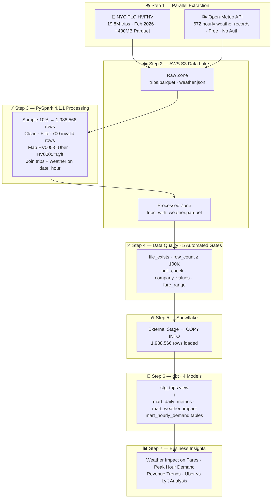

> 🎛️ **Orchestrated by Apache Airflow** — 8-task DAG running `@monthly`  
> 🐳 **Containerized with Docker** — runs identically on any machine  
> ⏱️ **Full pipeline completes in ~8 minutes**

---

## 📁 Project Structure

```
nyc_rideshare_pipeline/
├── data/
│   ├── raw/                          ← source data (gitignored)
│   └── processed/                    ← PySpark output (gitignored)
├── scripts/
│   ├── __init__.py
│   ├── logger.py                     ← structured logging
│   ├── download_data.py              ← fetch TLC Parquet from NYC.gov
│   ├── fetch_weather.py              ← fetch weather from Open-Meteo
│   ├── upload_raw_to_s3.py           ← upload raw data to S3
│   ├── process_with_spark.py         ← PySpark clean + join
│   ├── quality_checks.py             ← 5 automated quality gates
│   └── inspect_data.py               ← data profiling
├── nyc_dbt/
│   ├── models/
│   │   ├── staging/
│   │   │   ├── sources.yml
│   │   │   ├── stg_trips.sql         ← cleaned staging model
│   │   │   └── stg_trips.yml         ← dbt tests
│   │   └── marts/
│   │       ├── mart_daily_metrics.sql
│   │       ├── mart_weather_impact.sql
│   │       └── mart_hourly_demand.sql
│   └── dbt_project.yml
├── dags/
│   └── nyc_rideshare_dag.py          ← Airflow DAG
├── screenshots/                      ← pipeline run screenshots
├── Dockerfile                        ← container definition
├── docker-compose.yml                ← multi-service orchestration
├── .dockerignore
├── requirements.txt
└── README.md
```

## 🌐 Data Sources

### 1. NYC TLC HVFHV Trip Data
| Field | Detail |
|-------|--------|
| **Source** | NYC Taxi & Limousine Commission (official government data) |
| **URL** | https://www.nyc.gov/site/tlc/about/tlc-trip-record-data.page |
| **Format** | Parquet |
| **Period** | February 2026 |
| **Raw Size** | ~400MB — 19,875,686 trips |
| **Processed** | 1,988,566 rows (10% PySpark sample) |
| **License Codes** | `HV0003` = Uber · `HV0005` = Lyft |

### 2. Open-Meteo Weather API
| Field | Detail |
|-------|--------|
| **Source** | Open-Meteo Historical Weather API |
| **URL** | https://open-meteo.com |
| **Endpoint** | `archive-api.open-meteo.com/v1/archive` |
| **Location** | NYC — Lat `40.7128`, Lon `-74.0060` |
| **Granularity** | Hourly — 672 records for February 2026 |
| **Fields** | `temperature_2m`, `precipitation`, `windspeed_10m`, `weathercode` |
| **Auth** | None — completely free, no API key required |

---

## 🔄 Pipeline Steps

### Step 1 — Extract (Parallel)
- Downloads NYC TLC HVFHV Parquet (~400MB) directly from NYC.gov — no account needed
- Simultaneously fetches 672 hourly weather records from Open-Meteo API for February 2026
- Both files uploaded to **AWS S3 raw zone** via boto3

### Step 2 — PySpark Processing
- Creates SparkSession with `2g` driver memory, `4` shuffle partitions
- Reads 19,875,686 rows from Parquet
- Samples 10% → 1,988,566 rows for local processing
- Maps license codes: `HV0003` = Uber, `HV0005` = Lyft
- Extracts `pickup_date`, `pickup_hour`, `day_of_week`, `is_weekend`
- Converts `trip_time` seconds → `trip_minutes`
- Filters 700 invalid records (zero miles, zero fares, null timestamps)
- Joins trips with hourly weather on `pickup_date + pickup_hour`
- Saves final dataset to **S3 processed zone** as Parquet

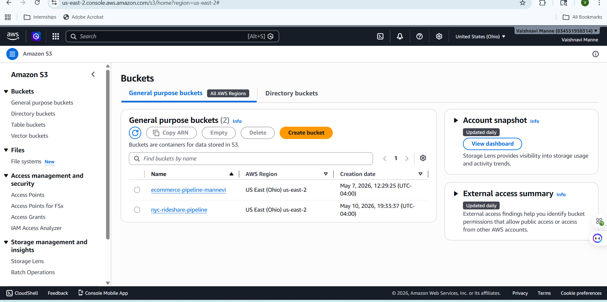

### Step 3 — Snowflake Load
- Creates external stage pointing to S3 processed zone
- `COPY INTO` loads 1,988,566 rows directly from S3
- No manual data movement — Snowflake reads S3 natively

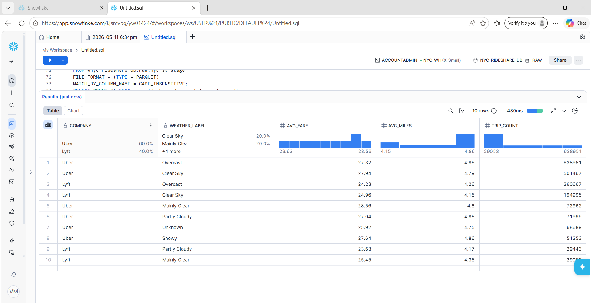

### Step 4 — dbt Transformations
- `stg_trips` — cleans columns, adds `temperature_f`, `temp_category` (Freezing/Cold/Mild/Warm), `is_bad_weather`, `total_passenger_payment`
- `mart_daily_metrics` — daily revenue, trips, avg fare by company + weather (materialized as **table**)
- `mart_weather_impact` — fare and tip analysis by weather condition (materialized as **table**)
- `mart_hourly_demand` — hourly trip demand by company and weekend flag (materialized as **table**)
- **5 dbt tests** — `not_null` and `accepted_values` on `pickup_date`, `company`, `passenger_fare`, `trip_miles`

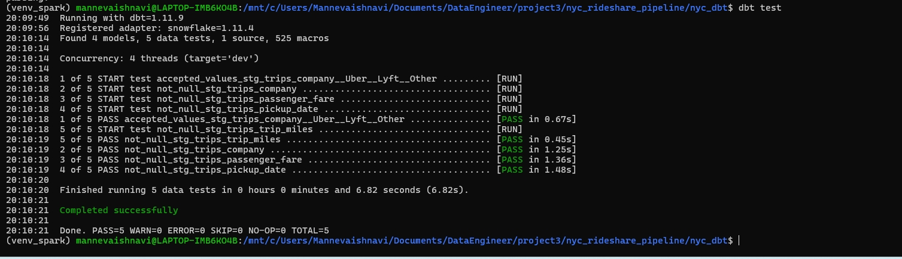
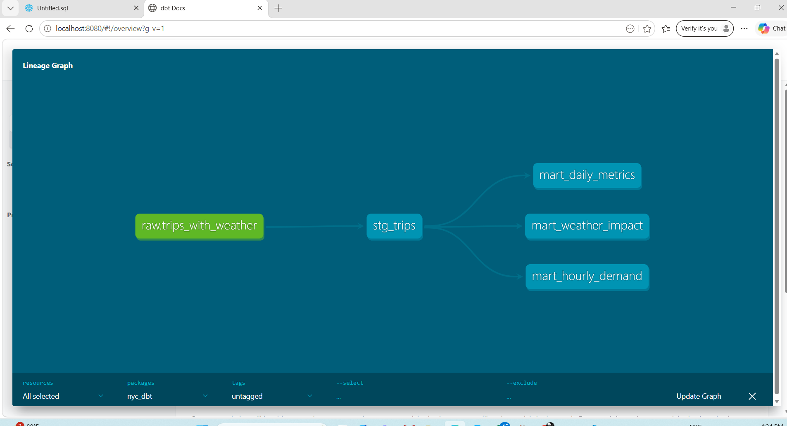

### Step 5 — Airflow Orchestration
- 8-task DAG runs `@monthly` with `catchup=False`
- `download_tlc` + `fetch_weather` execute **in parallel** → then sequential pipeline
- Full run: `download → weather → S3 upload → Spark → upload processed → quality checks → dbt run → dbt test`
- Retry logic — 1 retry with 5-minute delay on failure
- **Completes in 7 minutes 59 seconds**

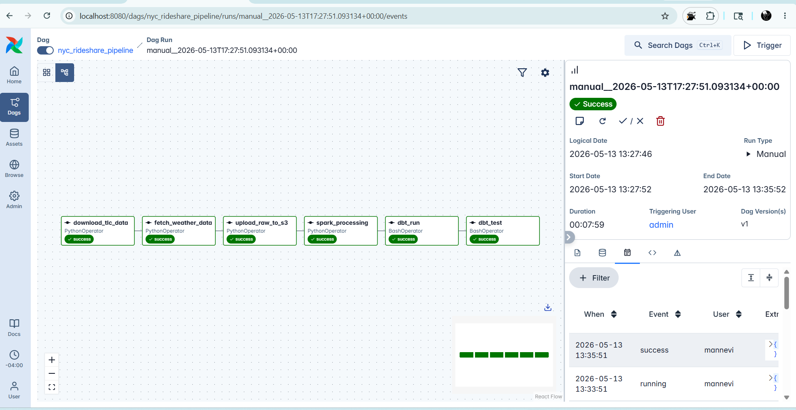

### Step 6 — Data Quality Gates
Five automated checks run before dbt — pipeline halts if any gate fails:

| Gate | Check |
|------|-------|
| `file_exists` | Processed Parquet file was created |
| `row_count` | Minimum 100,000 rows present |
| `null_check` | No nulls in `pickup_date`, `company`, `trip_miles`, `base_passenger_fare` |
| `company_values` | Only `Uber`, `Lyft`, `Other` in company column |
| `fare_range` | All fares are positive values |

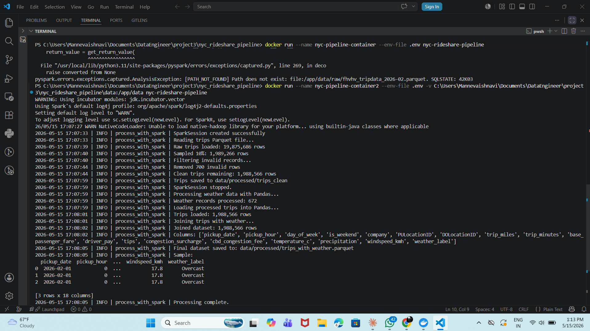

---

## ▶️ How to Run

### Option A — Docker (Recommended)

**1. Clone the repository**
```bash
git clone https://github.com/mannevi/nyc-rideshare-pipeline.git
cd nyc-rideshare-pipeline
```

**2. Add credentials to `.env`**
```
AWS_ACCESS_KEY_ID=your_key
AWS_SECRET_ACCESS_KEY=your_secret
AWS_BUCKET_NAME=nyc-rideshare-pipeline
AWS_REGION=us-east-2
```

**3. Build and run**
```bash
docker build -t nyc-rideshare-pipeline .
docker run --name nyc-pipeline \
  --env-file .env \
  -v $(pwd)/data:/app/data \
  nyc-rideshare-pipeline
```

### Option B — Run Step by Step

**1. Create virtual environment with Python 3.11**
```bash
python3.11 -m venv venv_spark
source venv_spark/bin/activate      # Mac/Linux/WSL
pip install -r requirements.txt
```

**2. Run each step**
```bash
python -m scripts.download_data
python -m scripts.fetch_weather
python -m scripts.upload_raw_to_s3
python -m scripts.process_with_spark
python -m scripts.quality_checks
cd nyc_dbt && dbt run && dbt test
```

> ⚠️ **Note:** PySpark requires Java and a Linux-compatible environment (WSL on Windows).
> Docker handles this automatically — recommended for Windows users.

---

## 📊 Business Insights

### Weather Impact on Fares
| Weather | Trips | Avg Fare | Avg Tips | Tip % |
|---------|-------|----------|----------|-------|
| Clear Sky | 543,790 | $26.99 | $1.17 | 4.34% |
| Overcast | 506,286 | $26.15 | $1.16 | 4.43% |
| Snowy | 50,875 | $28.23 | $1.21 | 4.27% |

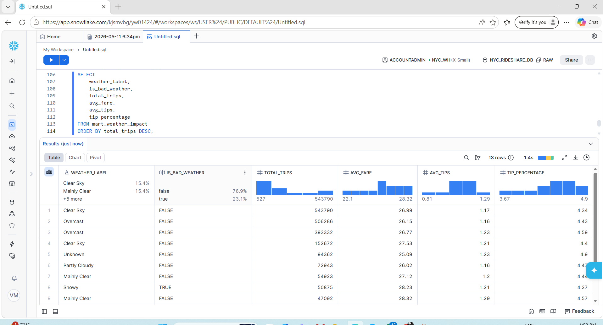

### Top Revenue Days
| Date | Total Revenue | Total Trips | Avg Temp |
|------|--------------|-------------|----------|
| 2026-02-13 (Fri) | $2,303,134 | 82,919 | 24°F |
| 2026-02-07 (Sat) | $2,281,090 | 95,619 | 10°F |
| 2026-02-27 (Fri) | $2,202,402 | 80,617 | 27°F |

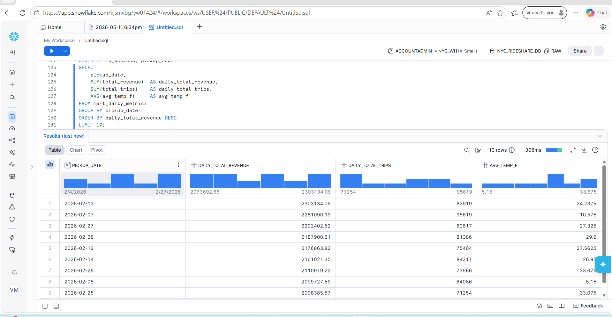

### Daily Revenue Trend
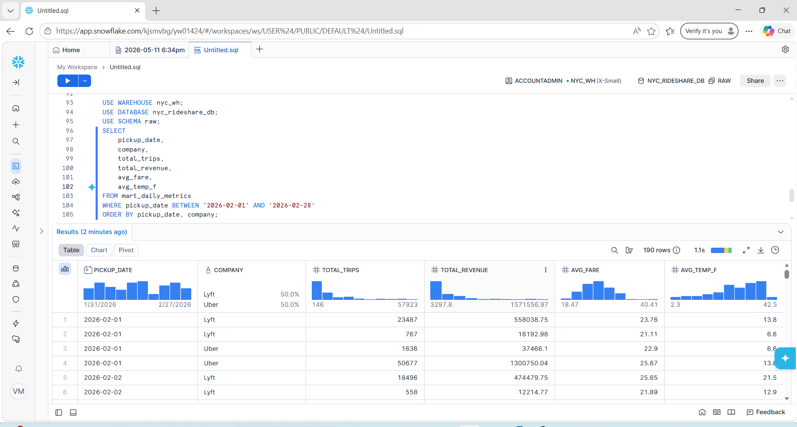

### Peak Hour Demand
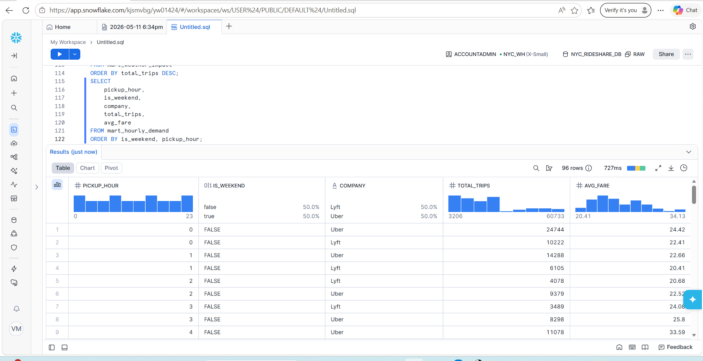

### Advanced SQL — CTEs + Window Functions
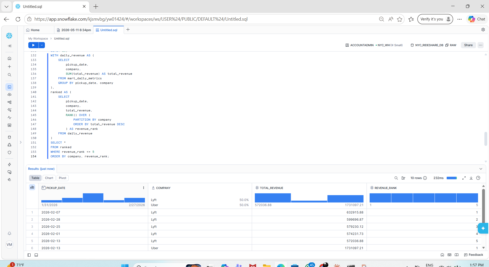

### Key Findings
- 🌨️ **Snowy conditions** drive highest avg fare — $28.23 vs $26.99 in clear weather
- 📅 **Feb 13** (Friday before Valentine's Day) — highest revenue day at $2.3M
- ⏰ **4AM trips** have highest avg fare at $33.59 — early morning surge pricing
- 🚗 **Uber** generated 3× Lyft revenue on peak days
- 💰 **Total Feb revenue** — ~$53M from 10% sample (~$530M extrapolated full dataset)

---

## 📊 Analytics Dashboard

Built in Tableau to visualize pipeline output — weather impact, revenue trends,
peak hours, and Uber vs Lyft breakdown across February 2026.

> 📌 Dashboard built on exported Snowflake data. Live Snowflake connection 
> is a planned future improvement.

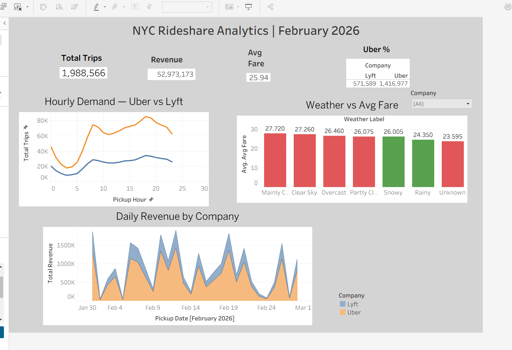

---

## 🧠 What I Built & Learned

| Challenge | How I Solved It |
|-----------|-----------------|
| 19.8M row Parquet too large for pandas | Used PySpark for distributed processing, switched to pandas only after sampling |
| PySpark ↔ pandas handoff | Stopped SparkSession cleanly before pandas work to avoid memory conflicts |
| Snowflake loading large files | Used S3 external stage + `COPY INTO` — no manual upload needed |
| Credentials security | `python-dotenv` with `.env` gitignored — never hardcoded |
| Pipeline reproducibility | Docker locks Python 3.11 + Java environment — runs identically anywhere |
| Data quality as a gate | Quality checks run before dbt — pipeline halts automatically on failure |

---
## 🚀 Future Improvements

- [ ] Expand to **multiple months** of TLC data for seasonal trend analysis
- [ ] Connect **Tableau directly to Snowflake** for live dashboard refresh instead of static export
- [ ] Add **incremental dbt models** — currently full refresh on every run
- [ ] Add **GitHub Actions CI/CD** — auto-run dbt tests on every push

---
## 👩‍💻 Author

**Manne Vaishnavi**  
MS in Computer Science  

[](https://github.com/mannevi)
[](https://www.linkedin.com/in/vaishnavimanne/)

---

*Built with real NYC government data — no mock datasets.*
