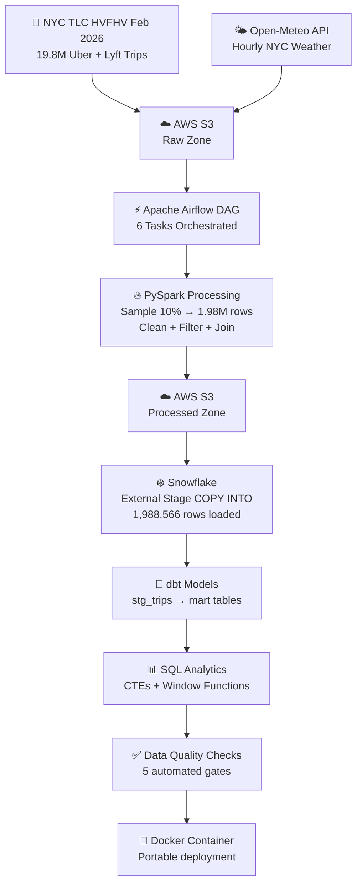

# 🚕 NYC Rideshare + Weather Pipeline | PySpark · Snowflake · dbt · Airflow · Docker · AWS S3

---

## 📖 Project Overview

A production-grade cloud data pipeline that processes real NYC Uber and Lyft trip data
from the official TLC dataset, enriches it with live weather conditions, loads it into
Snowflake, transforms it with dbt, orchestrates it with Apache Airflow, and containerizes
it with Docker.

Built to simulate a real-world ride-sharing analytics pipeline —
from raw government data to business-ready insights in Snowflake.

---

## 🎯 Business Objective

**Problem:**
Ride-sharing companies need to understand how external factors like weather, time of day,
and day of week affect trip demand, fares, and driver earnings — to optimize pricing
and resource allocation.

**Solution:**
This pipeline automatically ingests, processes, and analyzes nearly 2 million real
Uber and Lyft trips joined with hourly weather data to answer key business questions:
- Do passengers pay more during bad weather?
- Which hours generate the highest fares?
- How did cumulative revenue grow through February 2026?
- Which company dominates NYC rideshare on peak days?

---

## 🛠️ Tech Stack

| Tool | Usage in This Project |
|------|-----------------------|
| Python 3.11 | Core pipeline logic |
| Apache PySpark | Large-scale trip data processing (19.8M rows) |
| AWS S3 (boto3) | Data lake — raw and processed zones |
| Snowflake | Cloud data warehouse — stores 1.98M rows |
| dbt | Transforms raw Snowflake tables into business models |
| Apache Airflow | Orchestrates full pipeline end to end |
| Docker | Containerizes the pipeline for portability |
| Open-Meteo API | Free hourly weather data for NYC |
| pandas | Weather processing and final join |
| python-dotenv | Secure credentials management |
| Git & GitHub | Version control and portfolio hosting |

> 💡 Built on Python 3.11 in WSL — PySpark requires Linux-compatible environment.
> Docker image locks the environment so it runs identically anywhere.

---

## 🏗️ Pipeline Flow



---

## 📁 Project Structure

```
nyc_rideshare_pipeline/
├── data/
│   ├── raw/                          ← source data (gitignored)
│   └── processed/                    ← PySpark output (gitignored)
├── scripts/
│   ├── __init__.py
│   ├── logger.py                     ← structured logging
│   ├── download_data.py              ← fetch TLC Parquet from NYC.gov
│   ├── fetch_weather.py              ← fetch weather from Open-Meteo
│   ├── upload_raw_to_s3.py           ← upload raw data to S3
│   ├── process_with_spark.py         ← PySpark clean + join
│   ├── quality_checks.py             ← 5 automated quality gates
│   └── inspect_data.py               ← data profiling
├── nyc_dbt/
│   ├── models/
│   │   ├── staging/
│   │   │   ├── sources.yml
│   │   │   ├── stg_trips.sql         ← cleaned staging model
│   │   │   └── stg_trips.yml         ← dbt tests
│   │   └── marts/
│   │       ├── mart_daily_metrics.sql
│   │       ├── mart_weather_impact.sql
│   │       └── mart_hourly_demand.sql
│   └── dbt_project.yml
├── dags/
│   └── nyc_rideshare_dag.py          ← Airflow DAG
├── screenshots/                      ← pipeline run screenshots
├── Dockerfile                        ← container definition
├── docker-compose.yml                ← multi-service orchestration
├── .dockerignore
├── requirements.txt
└── README.md
```

---

## 🌐 Data Sources

| Source | Details |
|--------|---------|
| **NYC TLC HVFHV** | Official NYC Taxi & Limousine Commission data |
| **URL** | https://www.nyc.gov/site/tlc/about/tlc-trip-record-data.page |
| **Format** | Parquet |
| **Period** | February 2026 |
| **Raw size** | ~400MB — 19,875,686 trips |
| **Processed** | 1,988,566 rows (10% sample) |
| **Weather API** | Open-Meteo — https://open-meteo.com |
| **Weather granularity** | Hourly — 672 records for February 2026 |

---

## 🔄 Pipeline Steps

### Step 1 — Extract
- Downloads NYC TLC HVFHV Parquet file from official NYC.gov source
- Fetches hourly weather data from Open-Meteo API for February 2026
- Uploads both files to AWS S3 raw zone

### Step 2 — PySpark Processing
- Creates SparkSession with 2GB driver memory
- Reads 19.8M rows from Parquet
- Samples 10% → 1.98M rows for local processing
- Maps license numbers: HV0003 = Uber, HV0005 = Lyft
- Extracts pickup date, hour, day of week, weekend flag
- Converts trip_time seconds to minutes
- Filters invalid records (700 removed)
- Joins trips with hourly weather on date + hour
- Saves final dataset to S3 processed zone


### Step 3 — Snowflake Load
- Creates external stage pointing to S3 processed zone
- COPY INTO loads 1,988,566 rows directly from S3
- No manual data movement — Snowflake reads S3 natively


### Step 4 — dbt Transforms
- `stg_trips` — cleans columns, adds temperature_f, temp_category, is_bad_weather
- `mart_daily_metrics` — daily revenue, trips, avg fare by company and weather
- `mart_weather_impact` — fare and tip analysis by weather condition
- `mart_hourly_demand` — hourly trip demand by company and weekend flag
- 5 dbt tests — not_null and accepted_values on critical columns


### Step 5 — Airflow Orchestration
- 6-task DAG runs @monthly
- Tasks: download → weather → S3 upload → Spark → dbt run → dbt test
- Full pipeline completes in under 8 minutes
- Retry logic — 1 retry with 5 minute delay


### Step 6 — Quality Checks
- File existence check
- Row count check — minimum 100,000 rows
- Null check on 4 critical columns
- Company values check — only Uber/Lyft/Other
- Fare range check — all fares positive


---

## ▶️ How to Run

**1. Clone the repository**
```bash
git clone https://github.com/mannevi/nyc-rideshare-pipeline.git
cd nyc-rideshare-pipeline
```

**2. Create virtual environment with Python 3.11**
```bash
python3.11 -m venv venv_spark
source venv_spark/bin/activate      # Mac/Linux/WSL
pip install -r requirements.txt
```

**3. Add credentials to `.env`**
```
AWS_ACCESS_KEY_ID=your_key
AWS_SECRET_ACCESS_KEY=your_secret
AWS_BUCKET_NAME=nyc-rideshare-pipeline
AWS_REGION=us-east-2
```

**4. Run with Docker (recommended)**
```bash
docker build -t nyc-rideshare-pipeline .
docker run --name nyc-pipeline \
  --env-file .env \
  -v $(pwd)/data:/app/data \
  nyc-rideshare-pipeline
```

**5. Or run step by step**
```bash
python -m scripts.download_data
python -m scripts.fetch_weather
python -m scripts.upload_raw_to_s3
python -m scripts.process_with_spark
python -m scripts.quality_checks
cd nyc_dbt && dbt run && dbt test
```

---

## 📊 Sample Output + Business Insights

### Weather impact on fares

| Weather | Trips | Avg Fare | Avg Tips | Tip % |
|---------|-------|----------|----------|-------|
| Clear Sky | 543,790 | $26.99 | $1.17 | 4.34% |
| Overcast | 506,286 | $26.15 | $1.16 | 4.43% |
| Snowy | 50,875 | $28.23 | $1.21 | 4.27% |


### Top revenue days

| Date | Total Revenue | Total Trips | Avg Temp |
|------|--------------|-------------|----------|
| 2026-02-13 (Fri) | $2,303,134 | 82,919 | 24°F |
| 2026-02-07 (Sat) | $2,281,090 | 95,619 | 10°F |
| 2026-02-27 (Fri) | $2,202,402 | 80,617 | 27°F |


### SQL Analytics Screenshots


### Key findings

- **Snowy conditions** generate the highest avg fare — $28.23 vs $26.99 in clear weather
- **February 13** (Friday before Valentine's Day) was the highest revenue day at $2.3M
- **4am trips** have the highest avg fare at $33.59 — early morning surge pricing
- **Uber** generated 3x Lyft revenue on peak days
- **Total February revenue** — About $53M from 10% sample (~$530M extrapolated)
- **Cumulative revenue** grew from $1.9M on day 1 to $52.9M by end of February

---

## 🌀 Airflow DAG

All 6 tasks completed successfully in **7 minutes 59 seconds**:

```
download_tlc_data → fetch_weather_data → upload_raw_to_s3
→ spark_processing → dbt_run → dbt_test
```

Screenshots of the Airflow UI with all tasks green are in the `screenshots/` folder.

---

## 👩‍💻 Author

**Manne Vaishnavi**

MS in Computer Science

GitHub: https://github.com/mannevi
