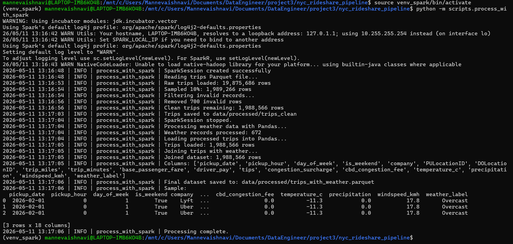
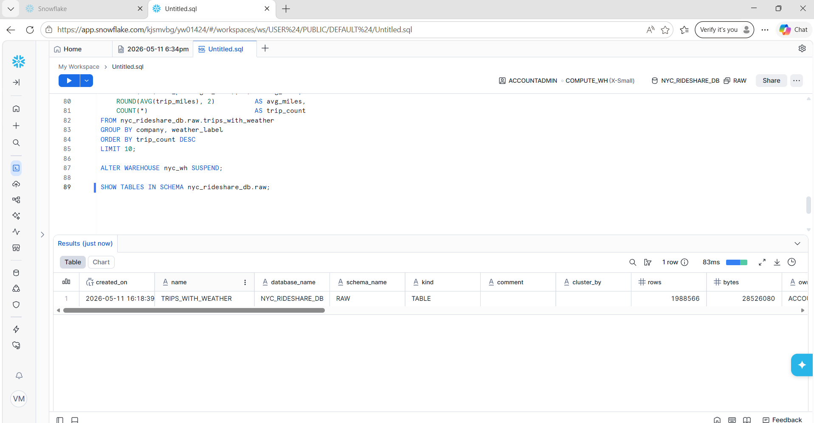
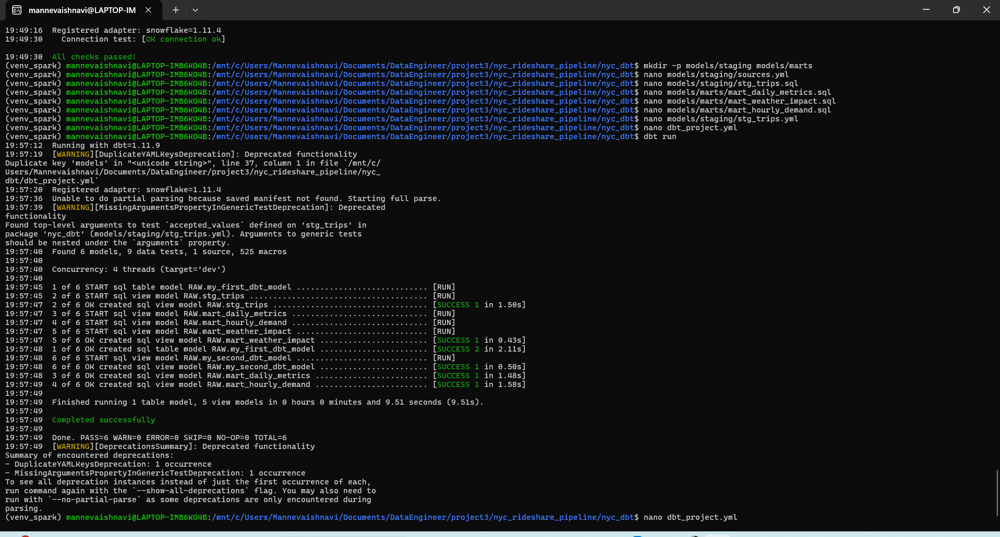
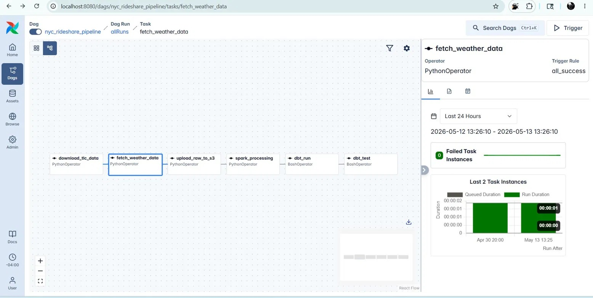
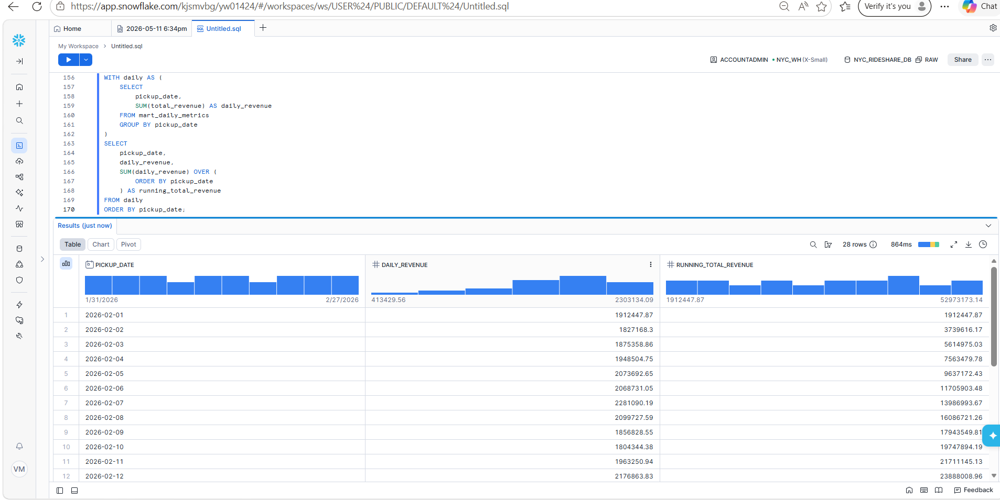

䭐Ѓ !鄲坯Ŧ ֥ Ȉ䍛湯整瑮呟灹獥⹝浸Ң⠂                                                                                                                                                                                                                                                                됀쮔썪ူﺅ톃멊ꔨ진辢᭥難訁临ꍂﺼㄸ⒥㐱웉켠篜࣏茱沚ᄉ瞵㴗膖库㝩缭ᥤゔ䇞㛉沀밴ᦽ㙌、딣鋃反伊ꎜ莜堕ø⪎辕⑖옺༙繂ᦋﯰ䮁ዯ钸ඃ⼇襐䦅纚␷఑榹뎬♊あ詚畄璾俪빊⡋륈쇭ູ䝸谍䰟⮨χ멶먏ꢚ搕ᅣ믓풰埅⨾벮塜ᙒ涧瀎꫺ዒ絚᛭鞢䢀湷텍걖滐翏쎔∔⼩툏睚恂ᣚ쯀㐓郱ऒƮ现䓮션ᑪ첿䄻쨪袝膩揋횴ႝ횉㐀ﻟ᳙魛酓㧔㺎괠놏篷嚣㓧聰埩⛗뵁ᒒΨ糙撻㾇 ＀Ͽ倀͋ᐄ؀ࠀ ℀Ḁ᪑ 一଀ࠀ异敲獬ⸯ敲獬ꈠȄꀨȀ                                                                                                                                                                                                                                                                銬櫁ッ䀌華菽뷑ᣁ亣振ࠇ䥛ፌ흪﷾˘䝡틋鏓竐鱳畆铠阚ൕ붊혉廹寃볻x薕ꖼ砱烖ೢ曶쫽䤣쨩讃ᕙ쾊ؚ颈샍䐪஧≩켩揔댤麣啱纘ꀳ㆙훕䡪筛ꨇ䔽蚾먝᧎੾㽦鞱ⴳ辐嶲哄鏪㊸檍ᨬぬ┯醜걢ᨊ볰ꍺꞿ觅ⲅꄉ褉אָ晼ቜ﹚諧᧦㘿⇯둙᭯嶜＀Ͽ倀͋ᐄ؀ࠀ ℀턀럒﨩
ᄀ 眀牯⽤潤畣敭瑮砮汭隤潭⃛耐便翚ﲈ얽ᱎ뇇嚚퍓﵎⤰띚䀟縰셑聘닳뽟랛益⇳쇀鰽룯뮃இ譧锓ᔪ컙湲歭㍁숢謴홷῏㟏떾ᩐⅧ≦㮣䫫ｰ폹㧝Ԉ㠩ဂઙ㧎姙횉聹⊐铲ꅈꑄ襯䣠兄⡊଺ꈙ旘霯傂悥䞿鶜늰ᱪ貹薣鼒崀ቄ㔬璽朌搲뚍Ὲ隂䀳藰杋媈䙍졹㕘뤀䂳할뒀䞞쟺秇䣳⇋㍩뒏鈚秼솤σ爮솚⑤윤蘚䘲쬜⊷ƿ蹰穵奌꾪듀ڽ펃淬䖆햠鰪⸠쩂慖ᅃꬻ妐듟웺ꃴ꿒嚛늃盂䑛騯쫨븱풫痷⥡蚽攤䟠ꦑ촤惒椲꜠᳷妬칷醝튿꾶탂윁徘軇쪳躉∽ښ櫑ㆌ쿡ᬽ㡋깙㧩᧗籙쀚rࣰ礝㑙뼌⁦旒⎤꫓員ㅑ뒜걳눳︆䱭ဏ錖쬐捕榇窌ꖏᵂ팦䵰邌엑✚땘卉ꌑ薑↠㶺畢飀洠㌽㩌槍᛫ᢽ዇꯵䔔퇞迒廑銺㙽ꞏ갉䗻絈飌ӗ僧㧉帉䳢籈恤ꐑ˯瀲䙑ﳀ䇃䴶ꗙ劗칮颉蓩싅䒔ừ脞ᅇ䵞쎛ᮄ壤២⇈짷띷镨롒땂溑Ὺ͈灸陷㽭⼿ᖺꐝ友溷⍏ぜ尽䘭ೆ襅젾ﲱ䰗㥂鱴릭쾤搁⯹䊿氷媈핀屶⻗楙确娔ᦍ窍঳⇅綅똷虯႑㞺஌๝櫭∻ʘ쪩ꄱ髕౒튯⛄楠ཆ⚩⯊傕띥ࢊƿ  䭐Ѓ !뺳ᶋą ζ Ĉ潷摲弯敲獬搯捯浵湥⹴浸⹬敲獬ꈠĄꀨĀ                                                                                                                                鎬櫍ッ萐藯莾篘㬭䍭鄉⥳岁搁ﵻꑣ婍綿䩅蜒팆躃戳빧햅ᖭꀻ뷳ȵ⒲蘅늦潵Ś씟項椧ꥪ䆬⌁吷슒쇺邳뱢躀塨ຫᶉ蓐욗ⴺ䠩噁늟빅퍈眥೓꿈ᚮ盠⏵抰榶ૺ浟ힵՆ䣷㘔⇳멓䤖지䉉ࣛꢋ㐈鰪ᰂ峵ᙽ痬⺉籬㠡獛쬐႘昔˱鑰暿윶ᳰꆓ蚱夊প莚詸鿻鲓➘縐ῲ ＀Ͽ倀͋ᐄ؀ࠀ ℀笀뱃쵝케 ᔀ 眀牯⽤桴浥⽥桴浥ㅥ砮汭姬譋䜛븐蘟쮹쵺뇨㙘䣒掲믆垱쵪ꫴ婧띴⵶↌Ꟙɜ✁ዤⷈႇ衢☡ﲗ֘쒛ᇹ㒑勓ﱏݚ瘓ꬅ籾ﵕ啵畵ㇻ蹵ᜱ▄뜝ꅺ㫢ᤸㆱ쉉箎惧橘躹⢐⌙ዊ燜堗鞸累짺둅⌣挜넓㪃⑮泥岧⌖䘘ˢ谦䣇靂䜱ꀧ꘷嫥튥율⒈鎮ᢠ䲜ࣈܻꕊ楻粥≟᪅儘꾾捔䉃읣꫓ዺᄋ⌜燚鵡㬱쀹ꗷ僫␤瑌諜現韋阮䋗ᙔ蛤濺뜩᠔歏蹚螇䅫䚽굷͟ෆ莚ꃆ횱Ƨ㑨鶂岦鵌嫍ⷠ㦱㟮膪澯믡諭砘䨍縖సᬲ䃦퍩싟뷻꽶ꃗ싘⬷뻝㓗᫰儔䲒킷뼕ད뭖䍝谦땞㞾홬唌䗎⩗좟墢톋C䤢䜒昮艸聆ဋ蜥㢜Ⓕ₌曰愨蘂딫냊蝒⣁鴧贎후裣✑꽱嚁ܷ識ꏩꝧ纏紻퇴쬯략껥⒢쯌諾뾿싿ῗ㵞웹ណﱹ鿋粿ﯹ？度됚綾폙俧ⱏ⻰蝇褁炱謶荡֖⇰㭿莉鄈䒼ष䨅銐ꂱ㈇퀲ᘷ⊈긋䶇郥氮⯀⏳쑾鋧聘ꏗØ㇮筆完瓷굝랕㳂ṹ᭷採蛁ޗ᧳㷄ꦱ∌크䖼쐨阉骎卣ⶌㄈ뫬䙇জ鄶㷎널ᲀ턚ঔ╝慥ࠣ㛾덬흷㇩卪쟟⛇츒ꈆ锶᪘뱦씒왖꘨鈮趑ﻤ辂茌ऋພ攱惎薌즰茋痮㍈띶퇯汅뤢匤爛ㄗ䞖蠴㱐犳䤦잔♾Ⴆ좢얹閤㌄衏菪借믮ᬄ绮ξ졩„晪淎ɇ⸼Ө魡⻲趏쓥ᴚ禽葨⻶ᓆꂝ옱鷎泏㙸氳醞ᚾ噁誹뙭蚹壌ﵕ଄閨煔煣ᄬ졆ᖐ汛鸤䨅쑢㒋食↚耳⺫욶ᴫ赍䩔㪸皴㜒汅꿬ࢭ愙瘟Ểய䷯ᣎ᳈莽縌ᥫ汯Λ资눅㦀偀ⷒᢈ쿮푄퉱獢㳄馴쨛䔛䱏힒䁖딛ﾏ퓟ᘾ뎉窩샬꧷詷쩒镦葓곛ɭ쟆洯棺烂墛축敹뿳沯캊秳猽콞힜瘳ྑ콐╤續됐떣藄经萦緒ꂹ坸쁇Ῑ意睐킴出ⳓ㥲ᜃꑲ໛≳ﶣ초饠庪ᐡ핋炡䱦鹿螤몭ӕ잝汻躜ꭖꞫₛ撀ึퟥᱪ㖊躙騶揙떼훣ĕﬥ␶譲⒙ᛪ촒䡫鷨ঝ뚋䖅ꥋ搯뾡庖쮁䇉쇪貥ꐠ쫇ꥏ쫼枻挢妮ힶ屖웏ۓ岉馸爤ᡡ㦱왼溾⹧匩퍬뙨萾喯෈ㄴ칻鰉몹樏框燖ৃ锉Ⴉ錍㮎䮒뽃晋熙ﬡ䑈䰩ꕏ迻쒉ꇜ蘤콘膻ᤦ檷ꦭ銑坫㸾벯艤뉇①싫꩜㫄黻할獡봠负鱏㩃럧᠑濊镖윁졄㖵蓇苧댻䛢媺䔞귣癋ᅄ䖝票禓휊㗭㐾췓饝๦疾⽟⚤䥲儂ꚷ缽롼㹋⫇﯋ꬆ甴휪ⅿ꣤譥퐙挔딋푬皤ֆ湁疹ᙨᇝ絧氛굆₺畖뵭曞䞇蘿꡽੔ᕍ땾ᑰ庬Ꙍ䂙꺏쮲㧌룩⨏흾樋偾뒪䇼ꯉ镻쭒훯嵋꿟ݗ땾ổ冂ᑤﵗﰡꟘ篛븽۵帿䘗⸬崳震낵荾굟뼕矁堈䇦㚣희뷛ꥆ䬎뽞⫗莵꽆濔촄냾ꇰᳫ끫귗帇큣㔪䆪ᔚ뽅⻕봵굚㗫궻힁롽㖴糬뷵꼲痦Ῡ ＀Ͽ倀͋ᐄ؀ࠀ ℀琀孾Ȁ
ᄀ 眀牯⽤敳瑴湩獧砮汭垴轭㣚︐퉾߽愆쪉뱖뜬ⵛ啭瓶鶟ǘ눸堝뽿Ꮁ櫒땩衟켳㏌箼쳿杙ꑋꊢ眘⮃䔡〦혭輿띵㒣〪ꉢ黮鯻＿띸ᑋ᫑哔⠇锊泰嵨鸦늧嵈銉䋦ꑲ嗡㶮啓㋶䯁榤᥊篕룽탛熈銷퉅촸傤휢Ⓠ礑㍎㳒薜赼⹤課䊓轛⒞戌蔐탚㥒︶沫渀줜柶넟쳥＂鼕Ꮋἒ帬鸓⠱좥劈䆰릜椀㫑뿮㨠뻸⟍⩚༰뭼踺灼䄙苸츠ᱥ෗އ잖ᐼ왟ἓ桸︠悵ࢎ異䔑뤘참飃焟갩㨲䞷놞ᩅ遭吺쵤뎘ᣋ䟻疌ㆁ㶑猝쮒㚒း秮螻旪杘몪Ẇ⩨겑䙧퉓䬼ퟮ邅攨ฐ皔ꨇ掳㎣낿靡䷊魮칅ˌ罒⌃꯭밐䮳≊顫뺇而蹉ꘪ償튺Ңⶕ颂憇會␛ꙑ岉⢕隃覛䭂鳁ᘞ蔟솞鏈釐薍耝櫭ཕ끓ဨ꾇ᤸ䮐憁䪒ퟒ堘쇯Ҏ缌ㅉ㑹寙㷩ଣ縈뽅䦒㾁䩔恓掴㟲Yイ㾞绁뉋䠠遗㞦晲扷棁꒹੒役㟧䙳鳳灈酀䬦Ἠ씪軹ఠ亂ᒭ៹ꆔꋝ⡇Ɤ킩綻膹｜仞竚軷់๮류ៅ핁ྟ塙橇ᛐ䟱硶뤖✍ꚓ享Ḷ쿎쌢샙㖟繅岊鸤䎝燦뙿輸ー㑡ꈍ졳ᅢ緎脛졷伈跌돠⭴囓帝챛伐䔥ꖝ㎹䙸锣协㡚┼㇈ꪲݒ競ꀵ戸Ŭ鬀鸜ꩠ㧊⶚岑벷蚍⬼ᦅ旀ῦ羑克㖕鎺겨엛ҩ绽䥣ﴋ륀ꮓ崪ꬹ䘂ᇵᕔ폸딼ᨥ쿊鶎搇鋪瞢뇿猩圦䒦ዉ斕㫩眘崙瑯詠썓蘛ꖫ䥽懗薃ଖ챫ꂾ糌栙謷ᙖ庑擤⭑㯫뽙ඕ沜쫐❢趋ͬ䶳娲䄼맓醥苧넱얮衟⓪ඨ줪㺼ꂇ䒼栭☎丙般蚩笛ㅉ콇æ挋㍨឴㺕㗑冘伮찙ꇽ㌙觞ⶱㅢ揧ꅆ圜鹻잶嗞㠝ણ呆✉ᚤ懒奿堧糦ퟮ㑺옛몋莛㶁땙抝䡟䔾猆莦擛ȱ绳鯜ꏸ꽉ԟㅨ笍瓑씚碣옚䵿몓⼿Ｗ＀Ͽ倀͋ᐄ؀ࠀ ℀ᄀꉑᄉᤀqሀ 眀牯⽤畮扭牥湩⹧浸쮝ꍮᑈ촣堻⟞兀곜婎掱㊏딚暌ꆍꌜ፰㭠料첿숼嘼슿⪜粠똡撀ꑁ঳嵶๾鵿粺良ዺꎅ쬭⃲澉㪵넞䯘⃼멾９룵늸ꏇ炼錍後㹙竾弯鍶፸夭ആꁇ嶓힌酅ᑎⳖ⣫닰伤앖鞵䩄媲ḅ癓䐫哕⫱ው칊楻㨎䅳碪㝫廋戬踨㝢䢅ℏ䉸㖢勎슦檣턈䉞唐쥃꟨웴駃铽午꒧锷绬赊詴চ꒞蘬嗊䖒Ů덯┧덲䷧պ꧂ћ⃋訌큗쵔왚ủ䄑꤯松䬅኉薟徺⒫ᙍ꩏埾㾲紏⺯޲ᛝࢥꋳ鯮齾魸얈炅쥍ࡘ☾빱刎㪹組ꃕ嵲沋᤯趰뫂⻝嫕땎䭳緛హ셻捗蔗ᖗ딵棅ॲꏙࡍ⎬₉쵥릁쭚Ʂ‖č揓㜭媋껃ᐴ㽯릻큎婲㫕꣥鵰潠횬൲഼䃦鉴稠ܝ߮륚滫⤘꾼롛㝫鎗咦땜࡜䕪ꁺ♘願牸겚榛ᒆ赼옎細﵄䬭ⵞ齸쏚쥾叓괇쉪⸟壟苻뻹卶쥘漣✔뮙ℌ頢⎾膘ㄣﰂ␧뼲鞈䗬ꧼ걞﹂㢒薾ꁓ첻첋諵魯瑨ꘁ鰒䄦鉼㠱時낼〼귞阊㍍㻦⛳╜硫❭᝛䫒妝ꛎ蕣䓗낛︈孠㸖ꚾ溬䨣幃뙚ꈪ갴೫駓匛뜏⊼䮀⽽䬑壝嬫姁ᅶ싉⛥夌ﬡ숿噆ﵗⲟ䮫뙃骪羧≦〞몢淖ᛠ웠䴤ᡠꈭ뻊ၡ㫧ⵥ妼㢓劺꫏⋋讉뮜箞搁棗蒙᠝呺쐐閳옋醕￦釔惉꺄鸢퓭贺ᒫ记囂於﷼궻㹌䣀튍之嘾鋎ᙍ沰跴໭㳼紭ꦯ﵍࿟閰퉨랧ᕬ緕ﵬ娛둳࿌㵌笮ꖯ惺딭语懪䩚檇堩쥴兒䰽赋媡㮋ꢓꘞⵐ퐵宋ꢔꘞ횥ⵠ⺵佮窢隘䏚풵ឤ➷㵑䬔⎕⸽ࡂ먿虶촐亞䙑ᷔⱂ魇펫卻贎Ōႄႄ還똖萢萠䭈䈑䈐䈐䈐䈐䈐⌾噓ࡧ琡팾퓯᥅睑턈윭꠶丿萁萐萐ᚐ⊶₄䢄ᅋ၂၂၂၂၂㹂萣⏰杁턈멧㡦钔甑ႇပ慤똘᨜ʙ℈℈℈氭ࡅࡁ隑萢萠萠萠萠萠䙼埻ࡧఱ慵팚῞嫇骘ᅩ⹽䚇¦ࡂࡂ䡂嬋䈑䈐ꖤ℈℈℈℈℈℈ᆟ䈙䩌摦燽唬龻៏仴贎Ōႄႄ還똖萢萠䭈䈑䈐䈐䈐䈐䈐⌾ꆕ萻஘볍䑥⇝軤⚪倈㐹Բ䈐䈐䈐ႊႂⴢࡅࡁࡁࡁࡁࡁ賹숐룓萳乬警搡掩䩯匎℀℄℄薤ࢭࠡ툡葒萐萐萐萐萐膐䡂㸣䫸﹞䚯︦ﱆሣᕐζ㮪䰣澩呦諷탟疰榪呩氳鞢⚦ꂽ迉촪甸আ狴卖젤䴙ꜯ᪚䂱냒蒫棏辊鶳ቪⓕ쓨⼼ࠪ賬哵倣㢕瘘ⴹᓞ⺵ઈ泜劈鸛ႝ㻕⨯䙵侔ꛙ榨픓뀠鳒괗坳隈዗潿߿  䭐Ѓ !객➶࿱ ꛈ  潷摲猯祴敬⹳浸ቆﶪᐇ皟ᰟ⑉䥅⢮䤩ힶ떪씝㞒䏏⡠Ȣ⸁娀빖爆움譁屑깛䢲綀て侧瓏쿣ᛟ鱅ꎃฟć썏訬ﯓ쇳뮗꽷ݎ允㒲䥢쇳⼓㼆뿷뫸鼨帒Ȅⴠ⽞볁霬ྯ討칰갗⇸斜苹繫끿怒櫃⫹ᛌ噋폆褸Ɤ恤⠮泙蜖䷼긖㰖锭䇽Ꮞ颁얥帼ᔖ揚됗ⳇ随ᙹꋲܐ䢽얂᫩棦而焖枘㙅缫ܐ穣ꂤ濾ꇑ듺㙈윀耸!蒘᯼惔ࠜᭋ踧㡰㖓ᱎ㡙鵾±ᖢ戊꨸⇺䣿୳被棊莎㢫逺겶獤챖裫ҳ㢇Ⴖ莵夥惸牣ꃜ꼝鼁鈖䗃﫸㻺狍䴶鈄쫰㡀ꁖ苿蘭絇盔ⰹ쏦鄬쐟ﶨꐤ攛ᯡ挾꒫ﳗ㜦쵟巧隖髸愕ﺉ䚊넗ｨ䗽쑚넃뎇벢戨룖⹳㐿৮튋糚䜙뙀ﱘ瘡敾쎇쭪流쉛﯒᭪彏罝箲㚢륽鮕ʦ糷띗툗샰頜毾ﭲ檛쥸壂쎵╦儗棩⡲鍁٘姱䫳셲敖ᩦQ谀ࢸ≖࣪㰫ⶺ軅至䭪ﱬ絲잓⹙때㘩ﱅ踾鸢㽚쑱魿셋춣忶⧟㑇숛镬쾊鎣ꒂ୾勹䷆㞱鉥侓⃒뾑앞욛秊⭿⎰䓃ﶓ㎜礹䜄მﮪ蠨뒡갨涣峆ᵭ請ꨕ톡᪾ꆫ緣㐵埙❃櫻瓨ൟ頩泧丨ㄣꠏ쏟f⻪蜜턚ุꆱᱱ䉚㣣芤燆Ĩ瑰踴迃㣑㜎妔쭂䟙漎읯㷝ኞ烼콷縀뮸븃蟮㮻ﮜ롾莻ḵ⽗芵Ⅻ뒳귬妲閖噩ꃲꏺ咱ꥠ验伆穎✼䠹᠂䓌ᯜ搭ﯪ཮≑鿵䯏頬鲫봗츻꿓줼㲖兠Ĉ平犮裇카㱧槧⧈鬝后艦멁䱚簉쥳짮碰ᄚ式䢅ᐒ໖맧䤔௔ｙ斮Ⲍ簾讈揾䄥쮂鉕≰侬⸴낦ਆ羦ꁪ褐٧ꘊ承煠㕆ل梍ತ턚ᦀꈴ퍱䧾渵贆ᨌ룑됙᝶覗꫶꣣⫮逹 趸可ᘦﴀᮧ㍓渍치珮鲶눇欌㌟鶶ⳋ੺⣮듦ስ뫕륞闈崸῵᫐锚횸䑸嫲ᇣ氉힍扟씟夲퀮폞㏤ꮷ娨풅둉ⲷ洅땿늱螿ѭ⻰௎ᤲ쌴砒⟰鲹璕䑒䶾אָ汷햃噟凛뒉ٻꂒ⦄ᡍｾ䢹ị⍺쮽⒒ᴑ淢枙ퟚ쥬ᔏ鴥Ｄ녶뎜嘢効ꈍ哻嵟ᄽ摼琇낓ꔸ꯭謅肓ծﻱ嬮㓊๓ഌ无陖苙파ɔ鼛鏾莦∗三袟ꢂꐼ껀艢䙉攣ᄑ墒왦䱩蜲밪榧ڈ⛭﫧鉺᎒얲⽒࠺▴袣п↫队닇䐮ꨥሻꬰ塬ꚬ羰ﮨ֔锤御ꕖ㾪ꖪ늮莦뿫ꡌ≟㘨ﴠ歠ﵰ똏䜆끵ॗ訫秘픊輛烪㰫鿭᧼Ⲽ⫙ᮡી沐⬄뉀찡햒ⴢ輨ḑ슰㺣䉞冗Ѹ㤥㲯좎僈呠⡌⨰ᐚᔘਇ钌ﺀ恘⿽뇓變ꭟ솣隈ᘀ锘醟ｎ杄ⱹ⨰匿呠꙾ꣀ䳼冁䷨柀넳ꘈ抛䠬鼪₳⛩뒚诤陥ﲳࢉ淲䄙咁򉉌鋉瘟渢䠂ꍙࡎ踚겔ቫ늋џ儕⒖䙙孔䳛쨸纲㌮❵Ⱔ褬☸궷韈ᥭ哨ﳶ쯏盠꺾錰鷃喖廂惝飓꩏姻첚帨ꨭ슎⦛ꌦ웮ꏊ왫鯆䒕ꎸ氥뉳狛䪳妮璞蒴鹭둶㩔妭෡Ήᴚꓡ翍㧖쎞仹볚浨魬괣鬭춤檋॒숮鹐耭瓬賓뻛碛ᔘ冹爰ꍲ홴ᮕ䶢齠ퟹ치飬ꦠ寚㵟媾睄鲊꺿崲꾷炝绪흓墵ꔸ༅焚屏ꋕ箌㬜ᮇ䐷룧蛣᳨鴐鄢᳓鈕⣜掝ᮓ玢犐ꁃᖣᆜ텰ꋣ됕觷ၖ⟅՘↸⼺栐䊡됈筐ᒬნꄨ猂ꄯᑂ傴СꡚȐ吭¸ৃ蓣葽儊葼儊䋐ႅꅨࡂ傴СꡚȐ吭뗏펽䯜Ⴈⴅࡔᚁ萪ୀ굕笗ᔈ઄緭઄籑઄큑蕂栐䊡됈⅐娄Ⴈⴂࡔኁ〪ዷ䐪ୁ䈕薠ℊ䋐럕祥ᔋ઄緭઄籑઄큑蕂栐䊡됈⅐娄Ⴈⴂࡔኁ〪ዷ䐪ୁ䈕薠ℊ䋐❕笋ᔈ઄緭઄籑઄큑蕂栐䊡됈⅐娄Ⴈⴂࡔኁ〪ዷ䐪ୁ䈕薠ℊﳚ鳓璢晝葿窯꼺瓊돪⭽භ唎쫵햍廽쮄第ᨈ㱯ꤜꍼ䠛䴼䳢ꢕꜝ淕畜щ쓪⿧Ἵ撺藮Ō룸▫ꦨ󳉜Ҷ춸淓끋ᳪ䖷䰒ꂶ璫嵙⊔⎦昖蜣孹뚴뜐棅჋炎摛ಶá얷쭣㣰손룺㣣홍韗萂眶Ⴔ洈८ꪹ㇂䘔퉗ࣜ⍳ꕴ跑৓➃ූ暅ෘ䟥鐵阙罪몡뀑䍔⼄ƪ㾌ვ鯊ࡪ䟥వ墌↪阂ｪ᪢൓벡蚩繐썔಩㕋쁄൒뀑邜ゝ哾⡃ꩯ鐡픟煰ꖇ√ꥠࢆ꩘舡픗였檟㕍᪣쥤ꩨȡ檖肈᪥砢൑ﱠ蚩䍔㚨喪ꔕ㕆憊᳋ࢷಳ፱斲ஈ雎䞡撶筙䭦舖뙧뤄㢪旇㙋湩꺄맬먑䁆솄䊆᪣⶗儵⿭㝔阂屪᪤⶗劵쮍媖용䭥ꩮፒ룕ꥬ檉䛬ꋰ霚딭赒雋꥚旆湋熪務픓沸覩屪풶畄৏৙俣⸵橛᪥⶗ꦹ旆䵋ꖲꨦፒ룕쥬㕉嬮ꕪ霚딭赒雋哜닣⚥熪務픓沸覩屪᪤⶗劵쮍媖용䭥蔟䱉ࣰ쬅胋秮ㅙ夯蟿縓獉摞埉Ԟ螴Ǻ鑵輇ힵ䥟䄪ﯱ豒粙먂뭵ꑒŸk࿕ꎯ毵꒪恉࡞㙦ຫ펛몵故ꎸ㖩㦸籗⼷劷䰭㢙循棤욀肋쑠⇒㍕獗ᮽ굗捾룄阹퟇ᅹ핇쏮㟃ꌧ⯓헣ཥ⾜褿헶虜௃淵廳꦳꙼ᢘ醁녾禙冩ꙭ뉫쥮材棚䥽﬜焥덛붯긧륦佹를佾⡜幕毵籸璦纮⊬燎⦀⯽冗⥅鷲榼㪮泙榿潎庳㳣ꝃᣳ梲果쇘㙹풲ꮿ볋漷箧酕㯡꽳ᦑ麶㗮멲릗菜뷆箉䍕烮嶯둎圏騙宕鷭檗佛ᥗ崻峅䏟⫣៣⫮뚧咧ὡ詺ྒꞽ醙⯿믝纾폓踣ẝ깡ꋛ裱⏃䪔幞ϩᗺ䶰怾墲Ἒ벘ὰŴ謥ڽ盧靛ᝰ럋廹븨空觃ᯓ䕌욂丛ாꡯﰆ̹黂㿹噯㐥鿼傾矾긱끄䗟见퟼ﾅᐷ쑫✳蛿ᨕ쿾ꋾ埼ﱃ䮬爀䏆㐬昏푷쳑阋俖刈垯윅顛㰜⻘⻽㕥ꖷ꫏Zהꝡ疣듶驲ꩨ蟅哫疒ꍏ䱯襃埽䤼㈾槾柂⹒ꇑṺ훧ꧾ땾펄圾⃧œꉾ㙟掛奖潨渘ꝵ쏨ꫡ䌐⭳끿뿝ⵚ뭵暗灧气쿢䁖푫⮁ᦌ眏ゆ偷翺ᓙꥍ炮⢺ም橑⬺ｽ岩ᤢ䗖ᝆ⏃蘢嵍麔㿡«덠ꟕ衸䭤輪汜覍㋘즥쎗뻖砋噈굴엍㇊⬑㲦ﷸ表ޜℰ쇢ዾꃪ撯⤠䗑ᜧ✥鑄㪘௙욕亟꺂룼㡈∥쳁羂妍秣ﷳ铝拨讌㎒䨢죌풿挩敏ﴶ貀뇭寖蚛嬘卟ᭈ᫂㊊愦핃䃎䲁㆟얓ㄱ면⹘粿䥞挧㊫蚫锸롃襢恹ếឹ浰품뽑蚪臥ꖬⶫ曇떾흗᭺⢝ష稶彉娵蹶馗뎟൦뷕큍ݺ銅뀫ㅖʛ䨔ꅪ쐿밉쫬糬ዦ瘷ȕ㾸ल终┚ૻ湄忎싸駱欩ꙖꝾ㛀稳蔫ᔦ魒蜠ㅦ㧣덗復Ỽ陖眲ꫥꁝ雍僸᫂᩵ᦼ䚪墨쒪퓢싍襎痬髤噝㖞볙掖걻䷔鬍믝᡼씎퓈像ᤎ㎫铼쑼熞뛅岵睇Ὑ禴懺ඇ隞率ڔ䂏鑍붻轣榗놙๨ꦗ独⺏측깮툭粍裲日ﺤ蕷⓰嫳㿮◤᤯鑏퓺箰얖柗齐▹̩摳邫듟奛㬚ꢝ꣞먓鯺䧺ꟿ䆖ᾁ몵ꃩ鈦ḝ⌚輷瓦៦ꍽ죤Ό䨪畎暫઴向⮒꒶㬙袰꺬턚只폱ÿ  䭐Ѓ !䣺ů Э  潷摲眯扥敓瑴湩獧砮汭펜滝⃂ﯠ笥蚇ꕻ㔺捋夵霖ⳝ뙋=꧂ȥƧ畜㽏햨磕督๓強뗮빊㫁⚉ꌧ䩡〒蔜鬴粜깽輆焤ᦞᓁ젚lj夜噵遲밃缏Ⓔ온驥ꓧ뻴⣊뱵촄ნ〫뉡ꭀྙ뭝骡᪮푰⵲㨇퍎椙笙芋ⅅ㰹ど즾ᚧၔ룑噒ꓮ럕㕨党峠轘䝖㍏칩棌ղ쥩㨭ﰬⰰ궦ꆨ既洨괢胾㽩籠찅᧻궏䍁흦ꊑ㎟㬻瑒ﾜ팕쐁ឮ縱픸鬑鲱ꋰ쟬캝욈쥙祜ᘩ龪있ꘋ澐⚻㰙磨骆꽧茛궖違귂쉌䫅㠚썾쓹দ잌業䊃⃅밢걟풼߲桖ⲟ໖贬䳃갩䉞庇⿅ ＀Ͽ倀͋ᐄ؀ࠀ ℀洀q派䤀
ሀ 眀牯⽤潦瑮慔汢⹥浸宕ᐰ䐿潹ⅳ詜锊諆椴쏚槚웏衱录ἢ৘⠴鄰ꩍ▴焢揧ｲ鎰砢٥嚸コ趹胃ꨩ깳돖쟰ቦ怆쪉킉춊㷂﹡쏱盽桚Ⅵﻀꘊ캒틂櫚䔚䭀द⦊Ⲭ醴妣鉇鞘畍땃袬⯥렮䟝ᱩ슏挆ꆮꋨ铠홽⍴늙羾顤ꉀ偖૲됎㗭궴礶㑥e朸権⒞ᵜ䤱ǖ义ڍ鱛㍌輢剋Ƽﶆ椀〇沢迗椱ᄘ泶硳连㨳硲婠粀௓ຑ㝰뷗苅㽥懜⊍韗剘⠒襏챇쑚섺Ꚅ洯洧Ѹꗮ䍛ꝉ홟ᭊኲ쉈ಬ넰༂坶὜뙅燳ꖧᐩᗂ솹ꩶ䒈폐깞諱ന섬垪뎂螏♸쮱燨숼・蜞殑䭈聢䘹ポ쎭鄅儏▣畑악ⴭ扗鮸嵃簅ᖍ堛죅蹩躰璇䤚活꜆錹䣓櫒檌ᴁ켑㉜븈涱ﲏᆜ㦗碣⚀ﰲ墥컊﩯⍻㢏륱㍼삲磈ﰲ㇔⌻ㇾ㦩ᯗ㣌ᜧ豬샑랝波뵤䡬㎝乳셇ⱷ㙅ླྀ㼗뻠炊ꝡ蹴㬞沅ﺬ㚇苊븈ﰲ䩂紬렪쌳䣤ꕻ氄䀹඿疒ʒ㙩齾刍࢛極隷ᙰ叾䴟¿  䭐Ѓ !岵ꄋŽ ̏ Ĉ潤偣潲獰振牯⹥浸Ң⠁                                                                                                                                谀썋ူ％銇㛷ꛭ䭃䕗佥舊씓颷宜몶謺蔃彲岾勯絜⪩胚틳⧨鋉䒔릠刑꘯秤謾䠯釤셩ꌪ䩡嗉穹灒玛᧑ซ頨쾴鶹▒춢ॼ力ဤ␺谿౓퐖븲ୢꎠ鴴Րӈ䙃愛筬ԩ闯嚪㠠અ栔㓴㉋恺鰑䟲됏ᾙ銤떸ᑰ⟝嗢쯋갞㫫잩ᨭ쿪ﷃﭓ놫䷔㢯느㰐襇鐕㴅쌬꿊㿟掁愇᷍㐰咮歌ヘ韩涚癤浹壖댙롊㶡賘ՠ溃Ԑ职仧ౚᬮѬ抺἞꓂␿鮈῭ﻷ᯦莅沍乞홹紒탆૕ਢ쯭暻㏯믛賹ꎔ㑴펉㣳鼻ᝧ᩹⦭灷⃾뭔︂챭䌦廣痐쮄o  䭐Ѓ !絛ū ˅ Ĉ潤偣潲獰愯灰砮汭ꈠĄꀨĀ                                                                                                                                銜位ッ蘌䣯蟼ᴭই幍ᨐ᱂飸ʴ⣧㒈銉扬ỿ蕧ђ稧ᾲ濇뭞ꮁܔ儌묻ᜮꫳ퀬Ꝋ涴絳묻謬蒘쉕謸놈柧ධ揎ᩈ䅣㘒쮮┮抿쨬笎뙔楔ꉅ됴㗌隍뻤魇䗘ⵕ븙됧픊迌뢠ꐺ諿✪뾳勸㴟燩놨䛷릏쳓䮕뀽䊑鋭따釮࠯এ䕬ㆋ↳垀吗ᗤ↰䶀舧覐韶ⓡ殃路⊖廑菹솖흅擩좶생䞦ڀꇘߜ躝橙슚뚽멸ࡠ嗈洐븐섻ى⤻渌瑨ࣞᄓ㟘趀뷫⒰웇꾳䷝싞쭧㡏ꝕᲅﲼ應ᑇ뤕ടŒѧ햓힩ꢶ캾⻼ಽ銯阯諳펾뺾䴘㸽︗＀Ͽ倀ŋⴂ᐀؀ࠀ ℀㈀澑晗ꔀጀ        嬀潃瑮湥彴祔数嵳砮汭䭐ȁ- !鄞뜚ï Ɏ 
      Ο 牟汥⽳爮汥偳ŋⴂ᐀؀ࠀ ℀턀럒﨩
ᄀ      뼀眀牯⽤潤畣敭瑮砮汭䭐ȁ- !뺳ᶋą ζ       ২ 潷摲弯敲獬搯捯浵湥⹴浸⹬敲獬䭐ȁ- !䍻嶼ۍ ⃏       య 潷摲琯敨敭琯敨敭⸱浸偬ŋⴂ᐀؀ࠀ ℀琀孾Ȁ
ᄀ      ⼀眀牯⽤敳瑴湩獧砮汭䭐ȁ- !儑ঢؑ 焙       ឹ 潷摲港浵敢楲杮砮汭䭐ȁ- !객➶࿱ ꛈ       ᷺ 潷摲猯祴敬⹳浸偬ŋⴂ᐀؀ࠀ ℀☀﫞潈ⴀ᐀      ᠀.眀牯⽤敷卢瑥楴杮⹳浸偬ŋⴂ᐀؀ࠀ ℀# 🚕 NYC Rideshare + Weather Pipeline | PySpark · Snowflake · dbt · Airflow · Docker · AWS S3


\---


\## 📖 Project Overview


A production-grade cloud data pipeline that processes real NYC Uber and Lyft trip data

from the official TLC dataset, enriches it with live weather conditions, loads it into

Snowflake, transforms it with dbt, orchestrates it with Apache Airflow, and containerizes

it with Docker.


Built to simulate a real-world ride-sharing analytics pipeline —

from raw government data to business-ready insights in Snowflake.


\---


\## 🎯 Business Objective


\*\*Problem:\*\*

Ride-sharing companies need to understand how external factors like weather, time of day,

and day of week affect trip demand, fares, and driver earnings — to optimize pricing

and resource allocation.


\*\*Solution:\*\*

This pipeline automatically ingests, processes, and analyzes nearly 2 million real

Uber and Lyft trips joined with hourly weather data to answer key business questions:

\- Do passengers pay more during bad weather?

\- Which hours generate the highest fares?

\- How did cumulative revenue grow through February 2026?

\- Which company dominates NYC rideshare on peak days?


\---


\## 🛠️ Tech Stack


| Tool | Usage in This Project |

|------|-----------------------|

| Python 3.11 | Core pipeline logic |

| Apache PySpark | Large-scale trip data processing (19.8M rows) |

| AWS S3 (boto3) | Data lake — raw and processed zones |

| Snowflake | Cloud data warehouse — stores 1.98M rows |

| dbt | Transforms raw Snowflake tables into business models |

| Apache Airflow | Orchestrates full pipeline end to end |

| Docker | Containerizes the pipeline for portability |

| Open-Meteo API | Free hourly weather data for NYC |

| pandas | Weather processing and final join |

| python-dotenv | Secure credentials management |

| Git \& GitHub | Version control and portfolio hosting |


> 💡 Built on Python 3.11 in WSL — PySpark requires Linux-compatible environment.

> Docker image locks the environment so it runs identically anywhere.


\---


\## 🏗️ Pipeline Flow


```mermaid

flowchart TD

&#x20;   A\[🚕 NYC TLC HVFHV Feb 2026\\n19.8M Uber + Lyft Trips] --> C\[☁️ AWS S3\\nRaw Zone]

&#x20;   B\[🌤️ Open-Meteo API\\nHourly NYC Weather] --> C

&#x20;   C --> D\[⚡ Apache Airflow DAG\\n6 Tasks Orchestrated]

&#x20;   D --> E\[🔥 PySpark Processing\\nSample 10% → 1.98M rows\\nClean + Filter + Join]

&#x20;   E --> F\[☁️ AWS S3\\nProcessed Zone]

&#x20;   F --> G\[❄️ Snowflake\\nExternal Stage COPY INTO\\n1,988,566 rows loaded]

&#x20;   G --> H\[🔧 dbt Models\\nstg\_trips → mart tables]

&#x20;   H --> I\[📊 SQL Analytics\\nCTEs + Window Functions]

&#x20;   I --> J\[✅ Data Quality Checks\\n5 automated gates]

&#x20;   J --> K\[🐳 Docker Container\\nPortable deployment]

```


\---


\## 📁 Project Structure


```

nyc\_rideshare\_pipeline/

├── data/

│   ├── raw/                          ← source data (gitignored)

│   └── processed/                    ← PySpark output (gitignored)

├── scripts/

│   ├── \_\_init\_\_.py

│   ├── logger.py                     ← structured logging

│   ├── download\_data.py              ← fetch TLC Parquet from NYC.gov

│   ├── fetch\_weather.py              ← fetch weather from Open-Meteo

│   ├── upload\_raw\_to\_s3.py           ← upload raw data to S3

│   ├── process\_with\_spark.py         ← PySpark clean + join

│   ├── quality\_checks.py             ← 5 automated quality gates

│   └── inspect\_data.py               ← data profiling

├── nyc\_dbt/

│   ├── models/

│   │   ├── staging/

│   │   │   ├── sources.yml

│   │   │   ├── stg\_trips.sql         ← cleaned staging model

│   │   │   └── stg\_trips.yml         ← dbt tests

│   │   └── marts/

│   │       ├── mart\_daily\_metrics.sql

│   │       ├── mart\_weather\_impact.sql

│   │       └── mart\_hourly\_demand.sql

│   └── dbt\_project.yml

├── dags/

│   └── nyc\_rideshare\_dag.py          ← Airflow DAG

├── screenshots/                      ← pipeline run screenshots

├── Dockerfile                        ← container definition

├── docker-compose.yml                ← multi-service orchestration

├── .dockerignore

├── requirements.txt

└── README.md

```


| File | Purpose |

|------|---------|

| `scripts/process\_with\_spark.py` | PySpark reads S3, cleans 19.8M trips, joins weather |

| `scripts/quality\_checks.py` | 5 automated checks after processing |

| `nyc\_dbt/models/staging/stg\_trips.sql` | Cleans and enriches raw Snowflake table |

| `nyc\_dbt/models/marts/` | Business-ready aggregated tables |

| `dags/nyc\_rideshare\_dag.py` | Airflow DAG — 6 tasks, @monthly schedule |

| `Dockerfile` | Python 3.11 + Java + PySpark environment |


\---


\## 🌐 Data Sources


| Source | Details |

|--------|---------|

| \*\*NYC TLC HVFHV\*\* | Official NYC Taxi \& Limousine Commission data |

| \*\*URL\*\* | https://www.nyc.gov/site/tlc/about/tlc-trip-record-data.page |

| \*\*Format\*\* | Parquet |

| \*\*Period\*\* | February 2026 |

| \*\*Raw size\*\* | \~400MB — 19,875,686 trips |

| \*\*Processed\*\* | 1,988,566 rows (10% sample) |

| \*\*Weather API\*\* | Open-Meteo — https://open-meteo.com |

| \*\*Weather granularity\*\* | Hourly — 672 records for February 2026 |


\---


\## 🔄 Pipeline Steps


\### Step 1 — Extract

\- Downloads NYC TLC HVFHV Parquet file from official NYC.gov source

\- Fetches hourly weather data from Open-Meteo API for February 2026

\- Uploads both files to AWS S3 raw zone


\### Step 2 — PySpark Processing

\- Creates SparkSession with 2GB driver memory

\- Reads 19.8M rows from Parquet

\- Samples 10% → 1.98M rows for local processing

\- Maps license numbers: HV0003 = Uber, HV0005 = Lyft

\- Extracts pickup date, hour, day of week, weekend flag

\- Converts trip\_time seconds to minutes

\- Filters invalid records (700 removed)

\- Joins trips with hourly weather on date + hour

\- Saves final dataset to S3 processed zone


 

\### Step 3 — Snowflake Load

\- Creates external stage pointing to S3 processed zone

\- COPY INTO loads 1,988,566 rows directly from S3

\- No manual data movement — Snowflake reads S3 natively




\### Step 4 — dbt Transforms

\- `stg\_trips` — cleans columns, adds temperature\_f, temp\_category, is\_bad\_weather

\- `mart\_daily\_metrics` — daily revenue, trips, avg fare by company and weather

\- `mart\_weather\_impact` — fare and tip analysis by weather condition

\- `mart\_hourly\_demand` — hourly trip demand by company and weekend flag

\- 5 dbt tests — not\_null and accepted\_values on critical columns




\### Step 5 — Airflow Orchestration

\- 6-task DAG runs @monthly

\- Tasks: download → weather → S3 upload → Spark → dbt run → dbt test

\- Full pipeline completes in under 8 minutes

\- Retry logic — 1 retry with 5 minute delay




\### Step 6 — Quality Checks

\- File existence check

\- Row count check — minimum 100,000 rows

\- Null check on 4 critical columns

\- Company values check — only Uber/Lyft/Other

\- Fare range check — all fares positive


\---


\## ▶️ How to Run


\*\*1. Clone the repository\*\*

```bash

git clone https://github.com/mannevi/nyc-rideshare-pipeline.git

cd nyc-rideshare-pipeline

```


\*\*2. Create virtual environment with Python 3.11\*\*

```bash

python3.11 -m venv venv\_spark

source venv\_spark/bin/activate      # Mac/Linux/WSL

pip install -r requirements.txt

```


\*\*3. Add credentials to `.env`\*\*

```

AWS\_ACCESS\_KEY\_ID=your\_key

AWS\_SECRET\_ACCESS\_KEY=your\_secret

AWS\_BUCKET\_NAME=nyc-rideshare-pipeline

AWS\_REGION=us-east-2

```


\*\*4. Run with Docker (recommended)\*\*

```bash

docker build -t nyc-rideshare-pipeline .

docker run --name nyc-pipeline \\

&#x20; --env-file .env \\

&#x20; -v $(pwd)/data:/app/data \\

&#x20; nyc-rideshare-pipeline

```


\*\*5. Or run step by step\*\*

```bash

python -m scripts.download\_data

python -m scripts.fetch\_weather

python -m scripts.upload\_raw\_to\_s3

python -m scripts.process\_with\_spark

python -m scripts.quality\_checks

cd nyc\_dbt \&\& dbt run \&\& dbt test

```


\---


\## 📊 Sample Output + Business Insights


\### Weather impact on fares


| Weather | Trips | Avg Fare | Avg Tips | Tip % |

|---------|-------|----------|----------|-------|

| Clear Sky | 543,790 | $26.99 | $1.17 | 4.34% |

| Overcast | 506,286 | $26.15 | $1.16 | 4.43% |

| Snowy | 50,875 | $28.23 | $1.21 | 4.27% |


\### Top revenue days


| Date | Total Revenue | Total Trips | Avg Temp |

|------|--------------|-------------|----------|

| 2026-02-13 (Fri) | $2,303,134 | 82,919 | 24°F |

| 2026-02-07 (Sat) | $2,281,090 | 95,619 | 10°F |

| 2026-02-27 (Fri) | $2,202,402 | 80,617 | 27°F |



\### Key findings


\- \*\*Snowy conditions\*\* generate the highest avg fare — $28.23 vs $26.99 in clear weather

\- \*\*February 13\*\* (Friday before Valentine's Day) was the highest revenue day at $2.3M

\- \*\*4am trips\*\* have the highest avg fare at $33.59 — early morning surge pricing

\- \*\*Uber\*\* generated 3x Lyft revenue on peak days

\- \*\*Total February revenue\*\* — \~$53M from 10% sample (\~$530M extrapolated)

\- \*\*Cumulative revenue\*\* grew from $1.9M on day 1 to $52.9M by end of February


\---


\## 🌀 Airflow DAG


All 6 tasks completed successfully in \*\*7 minutes 59 seconds\*\*:


```

download\_tlc\_data → fetch\_weather\_data → upload\_raw\_to\_s3

→ spark\_processing → dbt\_run → dbt\_test

```


Screenshots of the Airflow UI with all tasks green are in the `screenshots/` folder.


\---


\## 👩‍💻 Author


\*\*Manne Vaishnavi\*\*


MS in Computer Science


GitHub: https://github.com/mannevi洀q派䤀
ሀ      뤀/眀牯⽤潦瑮慔汢⹥浸偬ŋⴂ᐀؀ࠀ ℀딀ଡ଼綡ༀᄀ      嘀2搀捯牐灯⽳潣敲砮汭䭐ȁ- !絛ū ˅       㔊 潤偣潲獰愯灰砮汭䭐؅  

́ 㞫

